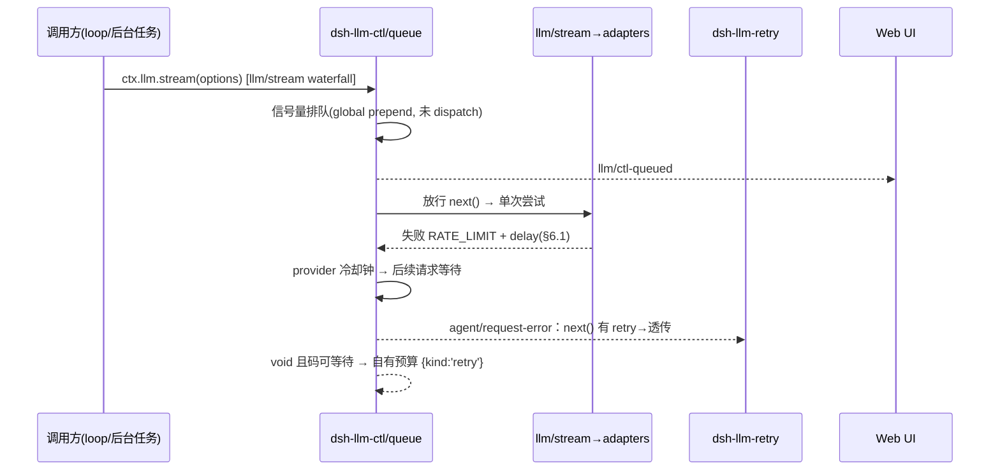

# dsh-llm-ctl PRD — LLM 调用管制插件（排队 / 过滤 / 开关）

> 状态：草案 v0.5（工程参数全部拍板，无遗留开放问题，可进入 M1）| 覆盖 profile：`web` | 形态：Cordis host 插件 + Web client 插件
> 对标现状：`dsh-llm` 单次尝试无排队；`dsh-llm-retry` 只在 `agent/request-error` 边界重试；`dsh-model-search-plugin` 是纯 DOM 搜索（无服务端目录过滤、无隐藏开关）。

## 1. 背景与问题

- 免费/共享 provider（如 `dsh-opencode-zen-free-provider`）高频触发 `RATE_LIMIT`（429 + `Retry-After`），当前行为是失败 → `dsh-llm-retry` 退避重试 → 仍失败 → 整轮结束。并发稍高就雪崩，无排队、无全局并发上限、无可见的等待态。
- 模型选择弹窗模型越堆越多：测试模型、欠费 provider、个人不用的系列全都显示。`dsh-model-search-plugin` 只能关键字搜，不能“彻底隐藏”。
- 没有“哪些显示、哪些不显示”的持久开关：换机器/清缓存就丢失，且与 `settings.models` 的 provider 目录各自为政。

## 2. 目标与非目标

**目标（MVP）：**

1. P0 — rate-limit 排队：per-provider 并发上限 + 全局队列 + `Retry-After` 优先 + 队列态可视。
2. P0 — 模型开关：provider / model 两级 `visible` 开关，持久化到 settings，模型弹窗与设置页同时生效。
3. P1 — 模型过滤：服务端目录过滤（隐藏项不下发）+ 客户端搜索框（复用/兼容 model-search 交互）。

**非目标：**

- 不做 provider 计费/配额统计，不做 token 级限流。
- 不改 `dsh-llm` 请求冻结语义、不重写 adapter wire 逻辑。
- 首版不做跨进程分布式队列（单进程内存队列 + 会话日志可观测即可）。

## 3. 用户故事

- US1：作为重度用户，我触发 429 时看到“排队中 #3，预计 ~12s”而不是整轮报错，我可以取消等待。
- US2：作为免费线路用户，我把 `provider.baseURL` 不稳的 10 个测试模型设为隐藏，模型弹窗清爽且设置页可一键恢复。
- US3：作为管理员，我为团队 profile 预置 `hiddenPatterns: ["*-test-*"]`，新人开箱即用，还能自己再隐藏。
- US4：作为现有 `dsh-model-search-plugin` 用户，装上 `dsh-llm-ctl` 后搜索框仍可用，不打架、不出双搜索框。

## 4. 功能需求

### FR1 排队（host 侧，P0 — 拦 `llm/stream`，前台后台全拦）

- FR1.1 准入边界：在 `llm/stream` waterfall 上挂 `global + prepend` listener（`dsh-session-title` 已验证此接缝可用）。`ctx.llm.stream()` 的**所有**调用方都被拦：agent loop、session-title、compaction 等后台任务一视同仁。在放行 `next()` 之前完成排队（信号量获取）；排队期间请求尚未 dispatch，因此不产生任何 provider I/O，chunk 协议零改动。每个请求排队上限受 `maxWaitMs` 约束，超时按 `QUEUE_TIMEOUT` 失败放行（返回单次失败 finish chunk，由调用方语义决定重试）。
- FR1.2 调度：per-provider 并发上限（默认**不限制**，包括免费线路；配置值 `0` = 不限制）+ per-provider **FIFO（时间优先）**。限流时的脆弱线路保护由冷却排队承担，不再设默认并发 cap。前台 loop 与后台任务（标题/压缩）同队，严格按到达时间排序，**不设优先级权重、不做 per-session 轮转**（已定：FIFO 足够，无需防饥饿机制）。同 provider 处于限流冷却时整队暂停放行。
- FR1.3 限流冷却（reactive）：请求失败且码 ∈ `RATE_LIMIT / SERVER / TIMEOUT / TRANSPORT / EMPTY_RESPONSE`（与 dsh-llm-retry 默认集一致）时，把该 provider 的放行时钟推到 `now + delay`；后续排队请求统一等冷却到期。延迟解析优先级见 §6.1（调研：notes/rate-limit-survey.md + notes/vendor-rate-limit-report.md）。`AUTH / INVALID_CREDENTIAL / QUOTA / INVALID_REQUEST / CONTEXT_WINDOW_EXCEEDED / NO_ADAPTER` 不触发冷却、不排队、直接透传。
- FR1.4 直调消费者的语义：直调 `ctx.llm.stream()` 的后台任务无重试边界（loop 之外不能安全重放 chunk）——ctl 只做「准入等待 + 失败即返回」，任何模式下都不内部重发；重试只发生在 agent/request-error 这个 durable 边界上。
- FR1.8 无 `dsh-llm-retry` 时的兜底（standalone 模式）：`dsh-llm-retry` 不挂载时（**当前 web profile 即是**），loop 对 `agent/request-error` 的默认处理是 void → throw，第一个 429 就炸轮。ctl 在该 waterfall 上 `prepend` 注册自己的 listener：先登记 provider 冷却，再调 `next()` 看下游动作——
  - 下游返回 `{kind:'retry'}`（retry 插件接管）→ 原样透传，ctl 不重复计数；
  - 下游返回 void（无 retry 插件 / 预算耗尽 / 码不在其默认集）→ 若失败码 ∈ 队列可等待集且冷却已登记，ctl 用**自有有界预算** `reactiveRetry.maxRetries`（默认 3）返回 `{kind:'retry'}`，等待 `delay`（§6.1 阶梯）后交 loop 在同一 open-turn 重跑；
  - 该预算只对 agent-loop 生效，且每次调度先写 durable 事件 `llm/ctl-retry`（durable-before-wait，对齐 retry 插件原则），取消/dispose 中断等待。
  - 配置 `reactiveRetry: 'auto' | 'off' | number`，默认 `'auto'`（=仅当下游 void 才接管，cap 3）；装了 retry 插件的部署行为不变，没装的部署从「429 即死」变为「有界自愈」。
- FR1.5 耐久可观测：入队/出队/冷却/取消写 `llm/ctl-queued`、`llm/ctl-dequeued` 非 surface 事件；后台任务的排队事件带 `origin: 'background'` 标记（session-title / compaction 可在 UI 区分显示）。取消与插件 dispose 中断等待。
- FR1.6 上限保护：单一等待预算 `maxWaitMs`（默认 120s，同时约束「单请求排队时长」与「愿意采纳的 provider 冷却时长」）+ `maxQueueDepth`（默认 50）。**已知 delay > `maxWaitMs` 时立即失败**（`QUEUE_TIMEOUT`），不先等满再失败——避免用户盯 2 分钟队列却拿到失败。超 `maxQueueDepth` 返回 `QUEUE_FULL`，两者均 delegate 下游。
- FR1.7 配置：独立于 provider adapter 的 `retryPolicy`，插件自有 `queue` 配置（见 §6）。`queue.maxWaitMs` / `maxQueueDepth` / 默认并发 `perProviderConcurrency.default` / 各 provider 并发覆盖另可在**设置 → 插件 → 插件配置**标签页全局调参（`settings.plugin.item`，按 settings namespace `llm-ctl` 分发）：写入 `llm-ctl` section 的 `queue` 切片（user 层覆盖，cordis 配置为底值），即时生效、无需重启；已在排队的请求仍按入队时的 deadline 计时，并发改动对之后准入的请求生效。

### FR2 模型开关（host + client，P0）

- FR2.1 两级开关：`providers.<id>.visible` + `models.<provider:model>.visible`，`false` 即隐藏；另支持通配预置 `hiddenPatterns: ["*-test-*", "zen-free:*nightly*"]`。**通配语义（已定）：只支持 `*`**（匹配任意长度字符，含 `:`），不支持正则、`?`、`[]`；匹配大小写不敏感。`provider:model` 可省略 provider 段。
- FR2.2 生效面：模型选择弹窗（不过滤不行）、`settings → 模型` 行（置灰 + “已隐藏”徽标 + 一键恢复）、`agentDefaultModel.currentSelection()` 兜底（默认模型被隐藏时回退并 toast 提示）。
- FR2.3 持久化：`llm-ctl` settings section（user 层），`settings.mutate` 路径写，带 revision 并发保护；composition 层只读预置 patterns。
- FR2.4 批量操作：按 provider 一键全显/全隐；隐藏 provider 自动折叠其模型。

### FR3 模型过滤（client 为主，P1）

- FR3.1 服务端目录过滤：`ctx.llm` 的 list/discover 返回前剔除 `visible=false` 项（display 层过滤，不删 adapter 注册）。
- FR3.2 客户端搜索：复用 model-search 交互（`Ctrl/Cmd+F` 聚焦、`Esc` 清除、防抖 200ms）。与 `dsh-model-search-plugin` 的让路用 **DOM 探测**：弹窗打开时检测其注入的 `.dsh-model-search-container` / `dsh-model-search-input` 元素（MutationObserver 已在监听同一弹窗，无额外开销）——检测到就只做隐藏项剔除，不注入第二个搜索框；未检测到（未装/未激活）才注入自己的搜索框。每次弹窗打开重新探测，装/卸/禁用无需重启。
- FR3.3 空态：全被过滤时显示“无可见模型 — 显示 N 个隐藏项”一键恢复入口。

## 5. UX（设置页 + 弹窗 + 队列条）

```tsx
<SettingsModelsPage>  (dsh-client-ui-settings-models)
  <ProviderRow provider="zen-free">            //  rightly: row 头加 👁 开关
    <CtlVisibilityToggle visible />             //  slots.inject("settings.models.provider-card")
    <ModelList>
      <ModelRow model="glm-4.6-test" hidden /> //  置灰 + “已隐藏”徽标 + 恢复按钮
  <CtlFooterBar>                                //  slots.inject("settings.models.footer")
    隐藏 N 项 [全部恢复] [ patterns 管理 ]

<ModelSelectMenu>  (dsh-client-ui-model-selection)
  [搜索框 …]              //  FR3.2，有 model-search 时让路
  <Group provider>        //  空组自动收起
  <QueueDockSeat>         //  FR1：pill「排队 N · ~12s」「冷却 N · 最长 12s」，点击弹 dialog 显示每条排队与[取消]，conversation.composer.dock 末位，idle 时 null
```

## 6. 配置（初稿）

```yaml
- name: 'dsh-llm-ctl'
  config:
    queue:
      perProviderConcurrency: { zen-free: 1 }  # 无 default 即不限制；0 = 不限制
      maxQueueDepth: 50
      maxWaitMs: 120000       # 单一等待预算：排队时长 + 愿意采纳的 provider 冷却时长
                              # 已知 delay > 它 → 立即 QUEUE_TIMEOUT（不白等）
      honorRetryAfter: true   # provider 提示优先于本地 backoff
      backoff: { initialDelayMs: 500, maxDelayMs: 10000, jitterRatio: 0.1 }
      reactiveRetry: 'auto'   # 无 dsh-llm-retry 时自有兜底预算：auto=下游void才接管(cap 3) | off | 数字
    visibility:
      hiddenPatterns: ['*-test-*'] # composition 预置，只读
      # 真正的开关落在 settings user 层 llm-ctl section（见下），不写 cordis config
```

### 6.1 限流延迟解析（对应调研 notes/rate-limit-survey.md）

按优先级取第一个可用值，全部缺失才落本地指数退避：

```text
delay =
  1. details.providerRetryAfterMs        # deepseek adapter 已透出（毫秒）
  2. Retry-After 头                       # 整数秒 | HTTP-date
  3. retry-after-ms 头                    # Azure 核实毫秒（SDK 同序）    [M2]
  4. x-ratelimit-reset                    # Together=秒；OpenRouter 带启发式 [M2]
  5. Go 时长串（OpenAI/Groq "6m0s"）      # 需时长串解析器                [M2]
  6. anthropic-*-reset（RFC3339）         # 注意本机时钟偏差              [M2]
  7. body code 白名单 → 本地 backoff      # 白名单见 notes/rate-limit-survey.md
```

- 2-6 级统一依赖同一个上游增强：adapter 把原始响应头透传进 `LlmError.details.headers`（当前仅 deepseek 给解析值）——MVP 实现 1/7 级，向上游提 issue 一次解锁全部 [M4]。
- 语义归类（vendor 核实）：429=入队；529/503=过载短退避（DSH 已归 SERVER）；402/403=配额/计费**不排队**（QUOTA/AUTH），UI 暂停告警；Bedrock ThrottlingException=429、ServiceQuotaExceeded=400 不退避。
- 无 Retry-After 厂商（DeepSeek/Gemini/SiliconFlow/百炼/Bedrock 等）必走本地退避——兜底层不可省。
- 流式陷阱：冷却登记同时覆盖 dispatch 抛错与**流中 terminal finish chunk**（OpenRouter 上游 429 以 SSE 块到达）两种形态。
- 防无底洞：任何来源的 delay > `maxWaitMs` 时不等待，立即按 `QUEUE_TIMEOUT` 失败并 delegate（单一预算，见 FR1.6）。
- epoch 启发式：`x-ratelimit-reset` 数值 > 3600 视为 epoch 秒并换算差值，同时记 `llm/ctl-queued {heuristic:'epoch'}` 便于核对。

```ts
// settings user 层：llm-ctl section（示意）
type LlmCtlSettings = {
  providers: Record<string, { visible: boolean }>
  models: Record<`${string}:${string}`, { visible: boolean }>  // "provider:model"
  revision: number
}
```

## 7. 架构与扩展点（只用官方接缝）

```text
src/
├── index.ts        # host 插件：队列服务 + visibility settings section + 目录过滤
├── queue.ts        # llm/stream 前置 listener：信号量 + per-provider FIFO + 冷却时钟
├── reactive.ts     # agent/request-error 兜底：下游 void 时自有预算重试（无 retry 插件时救轮）
├── delay.ts        # 延迟解析阶梯（§6.1）：providerRetryAfterMs → 头 → backoff
├── visibility.ts   # 开关读写：settings.mutate + patterns 编译 + 默认模型兜底
├── events.ts       # llm/ctl-queued|dequeued|ctl-retry 事件 payload（browser-safe）
├── client.ts       # client 插件：slots 注入 + 弹窗过滤 + 队列条
└── slot-contract.ts# 复用 settings.models.provider-card / footer 的类型 import
```



- 排队缝：`llm/stream` waterfall `global + prepend` listener（`dsh-session-title` 同款接缝）；放行前零 provider I/O，chunk 协议零改动，前台后台一网打尽。
- 重试缝：`agent/request-error` waterfall 中 ctl `prepend` 注册：先登记冷却，再 `next()` 透传下游动作——`dsh-llm-retry` 存在则归它（ctl 零重复计数），不存在/预算耗尽/码不合格则 ctl 用自有 `reactiveRetry` 预算兜底。两种部署形态下「谁拥有重试决策」唯一且可预测。
- client 发现机制与 `dsh-model-search-plugin` 完全一致：`dsh.bundle.patch` + `dsh.client`（`./client`），`dsh plugin add` 即自动激活。

## 8. 失败码与可观测

| 码 | 含义 | UI |
|---|---|---|
| `QUEUE_FULL` | 超 `maxQueueDepth` | toast + 设置入口 |
| `QUEUE_TIMEOUT` | 排队超 `maxWaitMs`，或已知 delay 超 `maxWaitMs`（立即失败） | “排队超时，已取消” + 重试按钮 |
| `MODEL_HIDDEN` | 当前选择被隐藏 | 自动回退默认模型 + toast |
| 透传 | `AUTH/QUOTA/INVALID_REQUEST/CONTEXT/NO_ADAPTER` 等 | 不排队不冷却，原样放行失败；`QUOTA/402` 额外「暂停并告警」 |

事件：`llm/ctl-queued {queueId, provider, origin: 'loop'|'background', position, etaMs, source?}` → `llm/ctl-dequeued {queueId, waitMs, outcome}`；standalone 兜底另发 `llm/ctl-retry {retryId, provider, attempt, delayMs, delegated:'void'}`。取消记 `cancelled:true`，冷却启发式记 `heuristic`。全部非 surface，不进模型上下文。

## 9. 里程碑与验收

- M1（排队 + standalone 兜底）：zen-free 并发打满时第 2+ 请求排队而非 429 炸轮；**未挂 `dsh-llm-retry` 的 profile（现状 web）首个 429 不再炸轮**——ctl 有界重试救回，`llm/ctl-retry` 事件可查；挂上 retry 插件后 ctl 自动让位（零重复重试）；session-title 后台任务被拦时队列条显示 `origin=background`；`Retry-After` 生效；`QUEUE_FULL` 与「delay > maxWaitMs 立即失败」可复现。
- M2（开关）：隐藏后弹窗+设置页同时消失；刷新/重启后保持；默认模型被隐藏可回退。
- M3（过滤兼容）：DOM 探测 model-search，共存无双搜索框；全隐空态有一键恢复。
- M4（延迟阶梯 2-6 级，单一上游依赖 `LlmError.details.headers` 透传）：retry-after-ms / x-ratelimit-reset / Go 时长串 / RFC3339 reset / body code 白名单生效；远期：成功响应头预测性节流（Groq 每响应都带 x-ratelimit-*）。
- 全量验收：`dsh plugin --profile web add -w <pkg>` 后重启即生效，无需手改 `cordis.patch.yml`。

## 10. 已定决策（本轮评审）

1. **队列拦 `llm/stream`**：所有 `ctx.llm.stream()` 调用方（loop + 后台任务）都在放行前排队；后台任务只等不重发。
2. **后台任务也要拦**：以 `origin` 字段区分显示，不做直通白名单。
3. **rate limit 全面调研**：13 家厂商一手核实（`notes/vendor-rate-limit-report.md`）；延迟阶梯与语义归类见 §6.1，MVP 落 1/7 级，2-6 级等 adapter 透传增强（M4）。
4. **model-search 让路 = 查 DOM**：弹窗打开时探测其注入的搜索框元素，按次探测，装/卸即插即生效。
5. **无 `dsh-llm-retry` 必须能独立工作**（本轮新增）：当前 web profile 即未挂 retry 插件；ctl 在 `agent/request-error` prepend，先冷却后 `next()`——下游有动作就透传（retry 插件拥有重试），void 才用自有有界预算（默认 3）兜底。装/卸 retry 插件无需改 ctl 配置。

## 11. 已定工程参数（本轮拍板，无遗留开放问题）

| # | 问题 | 决定 | 理由 |
|---|---|---|---|
| 1 | 队列公平性 | **FIFO 足够**，不做 per-session 轮转 | 单进程内并发请求数有限（loop 串行 + 少量后台任务），饥饿在实践中不会发生；少一层调度少一类 bug |
| 2 | `hiddenPatterns` 语法 | **只支持 `*`** 通配（任意长度、含 `:`），无正则/`?`/`[]`，大小写不敏感 | 隐藏模型是「我认得这个名字」的场景，正则对用户是负担；`*` 覆盖 `*-test-*`、`zen-free:*nightly*` 等全部实际需求 |
| 3 | 前台 vs 后台优先级 | **时间优先**：同队严格按到达时间 FIFO，不加权 | 排队语义可预测、可解释（用户看到的就是先来先服务）；后台任务被延后只会稍慢出标题，而插队会让前台用户看到「明明我先点」的不公 |
| 4 | 两个 120s 预算 | **合并为单一 `maxWaitMs`**；已知 delay 超上限 → 立即失败 | 两个语义相近的旋钮用户分不清；且「先等满 120s 再告诉你等不起」是最差 UX——已知等不到就立刻放行失败，把决定权交还用户 |
| 5 | standalone 兜底默认值 | **`auto`（cap 3）**，保留 `off` | 429 是瞬时错误，自愈明显优于炸轮；有 retry 插件时 `next()` 非 void → ctl 自动让位，两种部署行为一致可预期；想「失败即止」的运维可显式 `off` |

> 结论：PRD v0.5 无开放问题，已进入 M1 实施。

## 12. 实施状态（M1–M3 已完成，真实 GUI 验证通过）

代码在工作区根目录，包名 `dsh-llm-ctl`，`npm run verify` 全绿（typecheck + build + 41 项测试 + 真实 loader 冒烟启动）。

| 文件 | 职责 |
|---|---|
| `src/index.ts` | 插件入口：两条 waterfall listener + 兜底预算 + Remote 控制器 |
| `src/queue.ts` | per-provider 并发、FIFO 等待队列、冷却钟、ETA |
| `src/delay.ts` | 延迟阶梯 + 全部响应头解析器（2-6 级已实现待接线） |
| `src/reactive.ts` | standalone 决策、重试预算、可取消等待 |
| `src/config.ts` | 配置 schema、默认值、并发解析 |
| `src/events.ts` | 有界内存控制面日志 |
| `src/controller.ts` | `ctx.remote.llmCtl` 命名空间 |
| `src/client-plugin.ts` | 浏览器半：轮询队列条 + 取消 |
| `scripts/smoke-boot.sh` | 真实 loader 冒烟（workspace 内 DSH_HOME，不碰 ~/.dsh） |

已验证：

- `llm/stream` 前置排队：并发上限内直接放行，超限排队，`QUEUE_FULL`/`QUEUE_TIMEOUT`/`ABORTED` 三条拒绝路径；后台任务（`purpose=session-title/compaction`）同队并标 `origin=background`。
- 终端失败（dispatch 抛错或流中 `finish` chunk 两种形态）登记 provider 冷却；`QUOTA` 等终止码不冷却。
- `agent/request-error`：下游返回 `{kind:'retry'}` 时透传（零重复计数），下游 void 时用自有预算（默认 3）兜底。
- 真实 DSH loader 组合出 `llm-ctl` 行并在 scratch profile 启动成功。

**实现期对 PRD 的两处修正**（均记录在 README）：

1. **不写自定义 session 事件**：`Session.append()` 无法给 out-of-repo 事件类型打 `ignorable` 标记，而未标记的未知类型会让持久化读取路径拒绝重建会话。改为 host 日志 + 有界内存环 + `llmCtl` Remote。已作为上游诉求记录（为外部插件事件暴露 `ignorable`）。
2. **队列条为固定定位**：只读 Remote 命名空间，不对会话 DOM 做任何假设，因而不会与 `dsh-model-search-plugin` 等 DOM 插件冲突；内联版留给 M2/M3 在确认真实布局锚点后再做。
### 12.1 M2/M3 实施结果（本轮）

新增模块（`src/`）：`visibility.ts`（开关解析/过滤/回退）、`visibility-settings.ts`（settings section 适配层）、`menu-filter.ts`（模型弹窗 DOM 解析与过滤）、`settings-ui.ts`（设置页两个插槽的 React 视图）、`routes.ts` 扩展（可见性读写端点）。测试总数 108（node:test），全绿。

真实 GUI（scratch profile，端口 3099）逐项验证：

| 验收项 | 结果 |
|---|---|
| 隐藏模型后弹窗行消失 | ✅ POST `/api/llm-ctl/visibility` 后 ~2s 内 `display:none`，未误隐藏分组 |
| 全部隐藏 → 空态 | ✅ 9 行全隐，出现「无可见模型 / 显示全部隐藏项」，2 个分组收起 |
| 一键恢复 | ✅ 点击后 9 行全部恢复，空态消失 |
| 与 model-search 共存 | ✅ 实时探测到 `dsh-model-search-container` → 未注入第二个搜索框 |
| 设置页插槽 | ✅ 每个 provider 卡内渲染「提供方可见 + 每模型 👁」；页脚渲染隐藏统计 + 全部恢复 |
| 默认模型回退 | ✅ 事件日志出现 `default-model-fallback`（3 次）与 `default-model-hidden:no-visible-fallback`（全隐时），并写入 `agent-default-model` |
| 持久化 | ✅ `settings.yaml` 出现 `llm-ctl:` section；全部恢复后为 `{}` |

### 12.2 实施期新增的三处偏差（均有源码证据）

1. **客户端 Typert Remote 命名空间不可达**：`dsh-api-remotes` 的浏览器 proxy 只包含生成过的命名空间，第三方 namespace 不会出现在 `ctx.remote` 上。改用官方 HTTP 路由接缝 `ctx.inject(['webServer'], …).webServer.register({kind:'exact', path, handler})`（`dsh-doctor` 同款），保留 Typert 控制器供同进程/ACP 消费者。
2. **服务端目录过滤不可达**：`session.modelCatalog` 由 `dsh-api-session-controller` 内部 `buildModelCatalog(ctx, defaultSelection)` 直接构建，没有 waterfall 接缝。因此隐藏项仍会下发，由客户端在菜单 DOM 与设置页过滤。FR3.1 的「服务端不下发」需上游新增接缝。
3. **cordis 严格服务访问**：`ctx.<service>` 未声明 inject 会直接抛错（实测 `fatal load failure: cannot get property "agentDefaultModel" without inject`）。可选依赖一律走 `ctx.get(name)`，可选路由走 `ctx.inject([...])`。

### 12.3 客户端构建

`scripts/build-client.mjs` 改为 esbuild 打包（相对导入内联、React 等 8 个模块留给浏览器静态模块表），并在打包后于 Node 沙箱内求值校验 `exports.apply` 形状。客户端插件 `inject = ['slots','remote','remote.session','remote.llm']`，package.json `dsh.client.inject` 增加 `@deepseek-ai/dsh-client-ui-settings-models`。

### 12.4 打磨轮（统一搜索 / 冲突隔离）

- **统一搜索语法**：查询按空白分词，普通词同时匹配模型名与提供方名（大小写不敏感），`p:`/`provider:` 前缀把该词限定到提供方名（`p:zen flash` = 提供方含 zen 且模型含 flash）；裸 `p:` 被忽略，半输入不清空菜单。解析函数 `parseMenuQuery` 导出并单测。
- **冲突隔离**：自有搜索框的 `input`/`keydown` 处理器调 `stopPropagation()`，击键不再冒泡进弹窗或页面；搜索框锚定在分组容器正前方，同级链检查保证 pane 切换后重新锚定且稳态不搬动（搬动会喂 MutationObserver）。
- **兜底渲染**：无模型列表的第三方 provider 仍渲染 provider 级开关与提示文案（不单依赖 catalog.groups）。
- **可达性**：搜索框补 `name` + `aria-label`，消除控制台表单警告。

### 12.5 第三方模型清单发现

回答了「有没有办法获取第三方模型清单」：有三层。① adapter 启动快照（如 zen 抓 `opencode.ai/zen/v1/models` 公开 feed，一次性，失败则空目录）；② DSH 官方发现接缝 `ctx.llm.discoverModels(settingsNs, {baseURL, apiKey?})`（pi-ai 实现：有内置目录直接返回，否则 `GET {baseURL}/models`，apiKey 缺省时用已存 credential，插件不碰密钥）；③ 本插件的 `POST /api/llm-ctl/discover`（host `src/discover.ts` + client `src/discover-ui.ts`）：先走 adapter discovery，失败且 provider 为 zen 系时回退公开 feed；业务失败进 `error` 字段，只有 abort 才抛。

实时验证：zen-free 的 adapter 快照 6 个模型，上游发现 70 个（64 个 fresh）；设置页 provider 卡出现「刷新清单」→「上游发现（70）」+「新」徽标 + 👁 开关；开关落盘 `models: {'opencode-zen-free-provider:claude-fable-5': false}`。另修了一个真 bug：结果列表空时返回 null 会把刷新入口一起吞掉，改为列表外常驻入口按钮。

### 12.6 长列表折叠

模型多的卡（zen 上游发现 70 个）默认淹没页面。两处模型列表共用折叠基元（`settings-ui.ts`：`COLLAPSE_THRESHOLD = 8`、`defaultExpanded`、`CollapseToggle`、`useAutoCollapse`）：短列表默认展开（▾），长列表默认收起（▸）；收起状态跟随列表增长（刷新后 0→70 自动收起），用户手动切换后以手动为准。实时验证：收起时仅 11 个开关（页面紧凑），展开后 81 个开关。

### 12.7 与外部搜索插件的共存修复

**症状**：在模型选择弹窗的搜索框里输入，行过滤了一瞬间又全部还原。

**根因**：装有 `dsh-model-search-plugin` 时，弹窗内的搜索框是它的；我们的 `applyToMenu` 却在每次轮询（1s）和每次 DOM 变更时重写**所有**行的 `display`（通过行直接 `= ''`），把对方的过滤结果洗掉。

**修复**（`src/menu-visibility.ts` 新模块 + `applyToMenu` 分支）：探测到外部搜索控件时，只做隐藏、不碰其他——被我们开关拒绝的行设 `display:none` 并打标（`data-llm-ctl-hidden`），仅恢复我们自己标过的行；分组折叠、空态、搜索框全部让给对方。无外部控件时保持原有全量过滤。

**验证**：实时复现——在对方框输入 `flash`，T+1s 与 T+4s 均为稳定 3 行（修复前 1s 内还原）；再经由我们路由隐藏一个模型，该行消失而对方过滤不受影响；控制台无新增报错。单测 `test/menu-visibility.test.ts`（6 项）+ client 共存用例固定该行为。

### 12.8 provider-card 行归属修复

**症状**：「提供方可见」后的开关，对目录清单里的 dormant provider 与插件发现的 provider 无效。

**根因**：`settings.models.provider-card` 是 keyed 插槽，按 `settingsNs` 分发；共享同一 ns 的行（如所有 dormant pi-ai 路由共用 `llm-pi-ai`）收到的是同一个 seat 组件实例。旧代码用注册闭包里的 provider id，导致这些行全部操作第一个 provider——点的行没反应（实际写到了别的 key）。

**修复**：seat 从 owner props（`props.provider.provider`）取行归属，闭包 id 只做兜底；目录/目录外都建 fallback view。另抽 `resolveSeatProvider` 纯函数并单测。

**验证**：scratch 新建自定义提供方 `test-custom`（共享 `llm-pi-ai` ns），点其开关 → state 落 `providers: {'test-custom': false}`（正确键），卡片翻转为「提供方已隐藏」+ 🚫，其下模型继承隐藏，页脚计数「已隐藏 1 个提供方 / 1 个模型」。

### 12.7 回归测试补强

`test/client-plugin.test.ts`（jsdom）固定三条真实 GUI 上踩到的坑：菜单根面板（无行）不得误判为空态、隐藏项过滤、外部搜索控件让路；并断言空态节点在 700ms 内被重写的次数 ≤2，防止 MutationObserver 自反馈死循环。